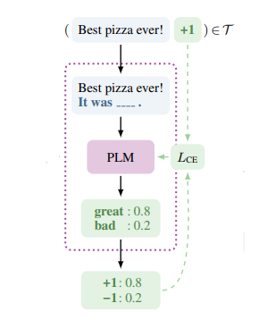

## (2) Masked Language Modeling

### Introduction

Masked Language Modeling (MLM) involves filling a masked token with the proper token to recover the meaning of the sentence. (Schick and Schütze, 2021a) converted classification task into MLM task by using verbalizer. When the MLM model finds the token with the highest probability for the masked token in the prompt (pattern), the verbalizer maps it to the original classification label.

 

For example, assume that the model has to classify the sentiment of the given text '_Best Pizza ever!_'. Following (Schick and Schütze, 2021a), the prompt created by entering the text into pattern, '_Best Pizza ever! It was [MASK]_',  is fed to the model. After the model calculates the probability of all tokens in the vocabulary for the _[MASK]_ token, it compares the probabilities corresponding to the verbalizer tokens '_great_' and '_bad_'. As '_great_' token is given a higher probability, the original label '_+1_ _(positive)_' mapped to it is selected as the final answer.           

### Performance

### Implementation
