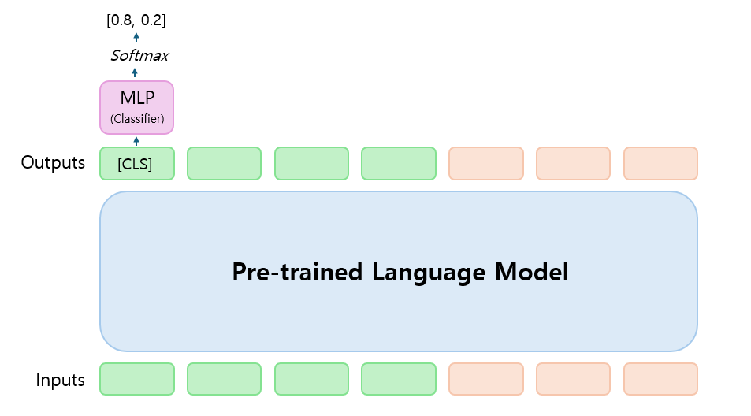

# 3. Matching

## Introduction

- 텍스트와 레이블 사이의 함의(Entaliment) 여부를 예측하는 방법입니다.
- 다중 분류 테스크를 이진 분류 테스크로 전환해 해결합니다. [BLOG](https://snumin44.tistory.com/16)
- 참고: [Entailment as Few-Shot Learner](https://arxiv.org/abs/2104.14690)   


      
## Experiment

- 모델, 데이터셋 등 구체적인 실험 정보는 다음과 같습니다.
  
  - PLM: __klue/bert-base__ (한국어 BERT)
  - Dataset: __KLUE 'ynat'__ (7 classes : IT/과학, 경제, 사회, 생활문화, 세계, 스포츠, 정치 )
  - Epochs: 10
  - Early Stop: 5
  - Batch Size: 128
  - Max Length: 256
  - Optimizer: AdamW
  - Learning Rate: 5e-5

- 템플릿에 따른 성능(accuracy)을 비교하면 다음과 같습니다.

||{}|이 뉴스의 주제는 {}이다.|{}에 관한 기사이다.|이 기사는 {}에 관한 내용이다.|
|:---:|:---:|:---:|:---:|:---:|
|ynat (valid set)|86.91 (%)|87.03 (%)|86.62 (%)|86.18 (%)|

- 직접 구축한 소규모 데이터 셋(175개 문장)으로 평가한 결과는 다음과 같습니다.

||{}|이 뉴스의 주제는 {}이다.|{}에 관한 기사이다.|이 기사는 {}에 관한 내용이다.|
|:---:|:---:|:---:|:---:|:---:|
|커스텀 데이터 셋|76.55 (%)|78.26 (%)|78.83 (%)|82.81 (%)|

## Implementation
- 다음과 같이 직접 모델을 학습하고 평가할 수 있습니다. (bin 파일만 저장됩니다.)
```
git clone https://github.com/snumin44/topic-classification.git
cd Matching/train
sh run_train.sh
```
- 다음과 같이 커스텀 데이터 셋(소규모 데이터 셋)을 평가할 수 있습니다.
```
cd Matching/evaluation
sh run_evaluate.sh
``` 
## Citing

```
@article{wang2020entailment,
  title={Entailment and Few-Shot Learner},
  author={Sinong Wang, Han Fang, Madian Khabsa, Hanzi Mao, Hao Ma},
  journal={Computing Research Repository},
  volume={arXiv:2104.14690},
  url={http://arxiv.org/abs/2009.07118},
  year={2020}
}
```
