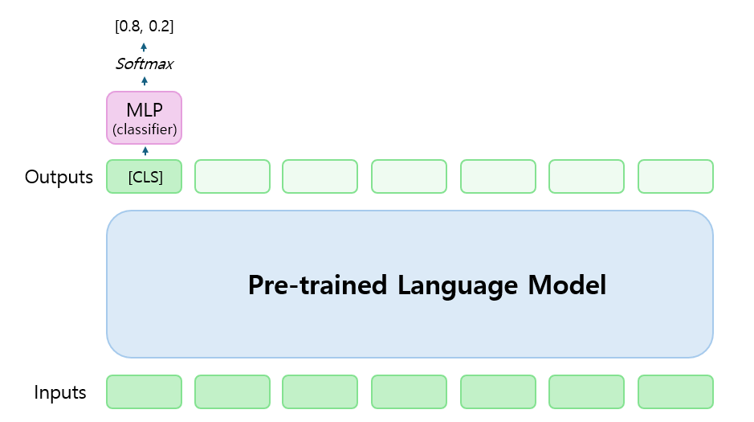
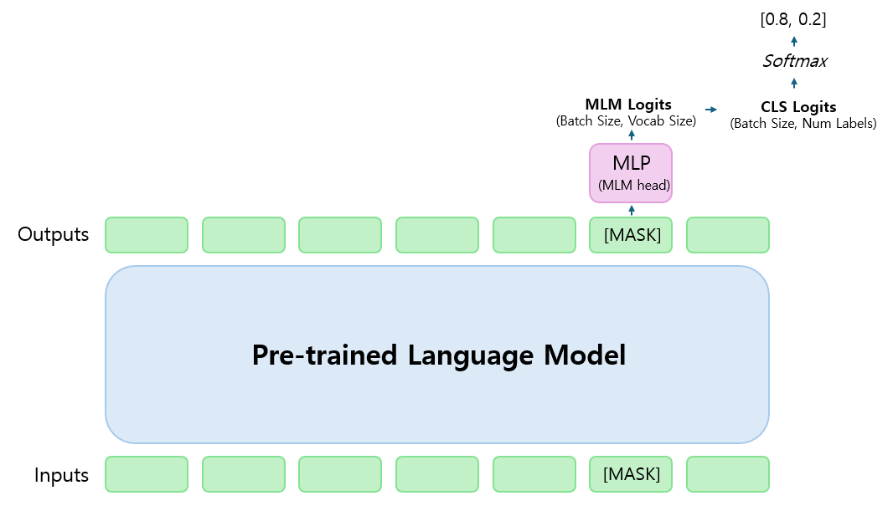

# Topic Classification with Different Approaches

__Topic Classification__ 을 다음과 같은 다양한 방법론으로 해결합니다.

1. [Classification](https://github.com/snumin44/topic-classification/tree/main/Classification) 
2. [Masked Language Modeling (MLM)](https://github.com/snumin44/topic-classification/tree/main/MLM)
3. [Matching](https://github.com/snumin44/topic-classification/tree/main/Matching)
4. Seq2Seq

## 1. Classification

- Classifier를 이용해 사전학습모델(PLM)을 Fine-tuning 하는 방법입니다.
- 일반적으로 Classification 테스크에서 사용되는 방법입니다. [BLOG](https://snumin44.tistory.com/13)



## 2. Masked Language Modeling (MLM)

- MLM Head를 이용해 프롬프트의 [MASK] 토큰을 예측하는 방법입니다.
- Verbalizer로 예측한 토큰과 레이블을 연결해 MLM 테스크를 분류 테스크로 전환합니다. [BLOG](https://snumin44.tistory.com/15)
- 참고: [Exploiting Cloze Questions for Few Shot Text Classification and Natural Language Inference](https://github.com/timoschick/pet)
- __License__ :This project is licensed under the Apache License, Version 2.0. See the LICENSE file for details.




## 3. Matching

- 텍스트와 레이블 사이의 함의(Entaliment) 여부를 예측하는 방법입니다.
- 다중 분류 테스크를 이진 분류 테스크로 전환해 해결합니다. [BLOG](https://snumin44.tistory.com/16)
- 참고: [Entailment as Few-Shot Learner](https://arxiv.org/abs/2104.14690)


## 4. Seq2Seq

- 인코더 모델이 아닌 Seq2Seq 모델을 이용해 분류 테스크를 해결합니다. 
- 분류 테스크를 생성 테스크로 전환해 해결합니다.

## Citing

```
@article{schick2020exploiting,
  title={Exploiting Cloze Questions for Few-Shot Text Classification and Natural Language Inference},
  author={Timo Schick and Hinrich Schütze},
  journal={Computing Research Repository},
  volume={arXiv:2001.07676},
  url={http://arxiv.org/abs/2001.07676},
  year={2020}
}
@article{schick2020small,
  title={It's Not Just Size That Matters: Small Language Models Are Also Few-Shot Learners},
  author={Timo Schick and Hinrich Schütze},
  journal={Computing Research Repository},
  volume={arXiv:2009.07118},
  url={http://arxiv.org/abs/2009.07118},
  year={2020}
}
@article{wang2020entailment,
  title={Entailment and Few-Shot Learner},
  author={Sinong Wang, Han Fang, Madian Khabsa, Hanzi Mao, Hao Ma},
  journal={Computing Research Repository},
  volume={arXiv:2104.14690},
  url={http://arxiv.org/abs/2009.07118},
  year={2020}
}
```


