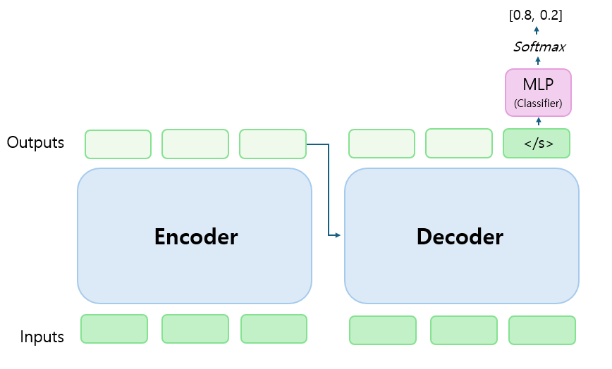

# 4. Seq2Seq

## Introduction

- 텍스트와 레이블 사이의 함의(Entaliment) 여부를 예측하는 방법입니다.
- 다중 분류 테스크를 이진 분류 테스크로 전환해 해결합니다. [BLOG](https://snumin44.tistory.com/17)


      
## Experiment

- 모델, 데이터셋 등 구체적인 실험 정보는 다음과 같습니다.
  
  - PLM: __gogamza/kobart-base-v2__ (한국어 BART)
  - Dataset: __KLUE 'ynat'__ (7 classes : IT/과학, 경제, 사회, 생활문화, 세계, 스포츠, 정치 )
  - Epochs: 10
  - Early Stop: 5
  - Batch Size: 128
  - Max Length: 256
  - Optimizer: AdamW
  - Learning Rate: 5e-5

- 성능(accuracy)은 다음과 같습니다.

||__gogamza/kobart-base-v2__|
|:---:|:---:|
|ynat (valid set)|82.30 (%)|

- 직접 구축한 소규모 데이터 셋(175개 문장)으로 평가한 결과는 다음과 같습니다.

||__gogamza/kobart-base-v2__|
|:---:|:---:|
|커스텀 데이터 셋|77.07 (%)|

## Implementation
- 다음과 같이 직접 모델을 학습하고 평가할 수 있습니다. (bin 파일만 저장됩니다.)
```
git clone https://github.com/snumin44/topic-classification.git
cd Seq2Seq/train
sh run_train.sh
```
- 다음과 같이 커스텀 데이터 셋(소규모 데이터 셋)을 평가할 수 있습니다.
```
cd Seq2Seq/evaluation
sh run_evaluate.sh
``` 
